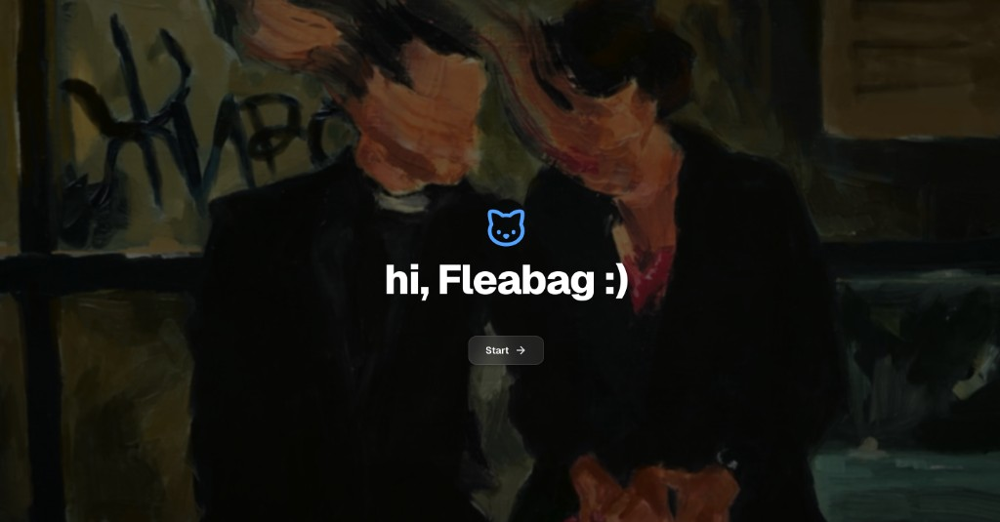
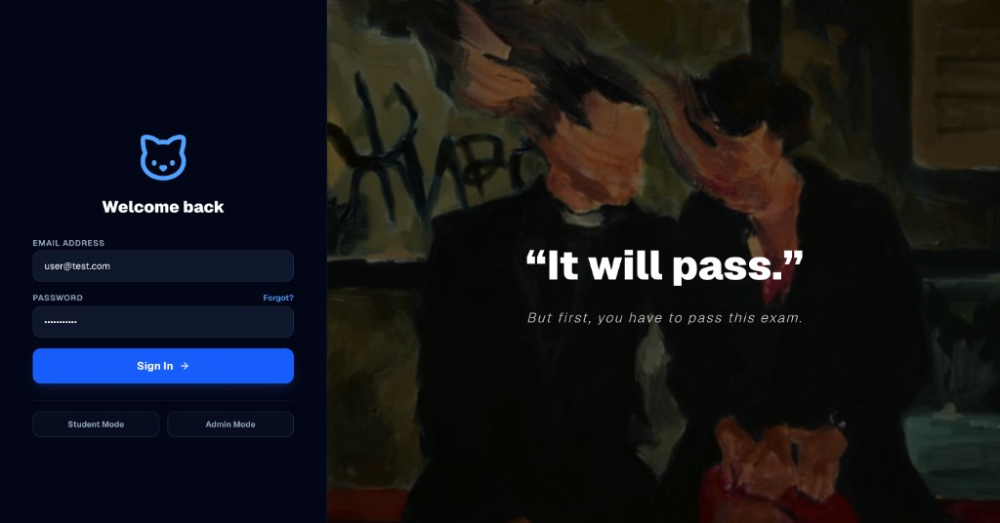
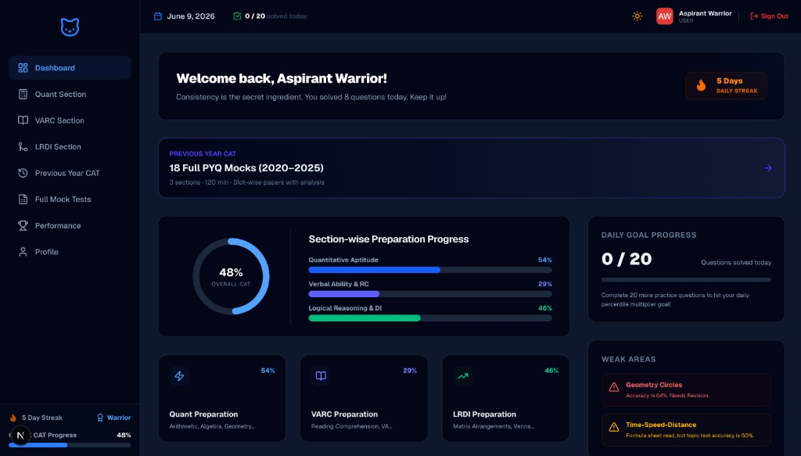

# CATPrep – Progress Driven CAT Preparation Platform

[](https://nextjs.org/)
[](https://www.typescriptlang.org/)
[](https://www.prisma.io/)
[](./LICENSE)

## Overview

**CATPrep** is a full-stack CAT (Common Admission Test) preparation platform built for serious MBA aspirants who want measurable progress—not just more questions.

### Purpose

CATPrep helps students prepare systematically for India's most competitive MBA entrance exam by combining structured topic practice, realistic mock tests, previous-year paper simulation, and data-driven performance analytics in one place.

### Target Audience

- CAT aspirants targeting IIMs and top B-schools
- Students who want section-wise mastery (Quant, VARC, LRDI)
- Learners who benefit from streaks, daily goals, and progress dashboards

### Problem Being Solved

Most CAT prep tools either dump question banks without structure or offer mocks without actionable feedback. CATPrep bridges that gap with a **progress-driven workflow**: formula sheets → practice → subtopic tests → section mocks → full mocks → PYQ analysis—so every study session moves the needle.

## Features

- **Full Mock Tests** — Timed full-length CAT simulations with scoring and percentile estimates
- **Quant Section** — Topic-wise subtopics, formula sheets, practice, and tests
- **VARC Section** — Reading comprehension, para jumbles, and verbal practice flows
- **LRDI Section** — Logic sets, caselets, and structured DILR practice
- **Previous Year CAT Papers** — Slot-wise PYQ mocks (2020–2025) with CAT-style exam UI
- **Progress Tracking** — Subtopic checklists and completion states per section
- **Performance Analytics** — Section strengths, trends, and attempt history
- **User Dashboard** — Daily goals, streaks, quotes, and quick navigation
- **Streak Tracking** — Consistency rewards for daily practice
- **CAT-inspired Exam Interface** — Section timers, palette navigation, and review flags

## Tech Stack

| Layer | Technology |
|-------|------------|
| **Frontend** | Next.js, React, TypeScript, Tailwind CSS |
| **Backend** | Node.js (Next.js App Router API routes) |
| **Database** | PostgreSQL / Prisma |
| **Authentication** | JWT via NextAuth.js (Credentials provider) |
| **Deployment** | Vercel |

## Screenshots

### Landing Page


### Login


### Dashboard


### Quant Section


### Previous Year Papers


### Performance Analytics


> Additional screenshots: see [screenshots/CAPTURE_GUIDE.md](./screenshots/CAPTURE_GUIDE.md) for remaining captures (`varc`, `lrdi`, `mock-test`, `profile`).

## Quick Start

```bash
# Clone the repository
git clone https://github.com/YOUR_USERNAME/cat-prep-platform.git
cd cat-prep-platform

# Install dependencies
npm install

# Configure environment
cp .env.example .env

# Start PostgreSQL and set up database
npm run db:up
npm run db:push
npm run db:seed

# Start development server
npm run dev
```

Open [http://localhost:3000](http://localhost:3000).

**Demo credentials** (after seeding):

| Role | Email | Password |
|------|-------|----------|
| User | `user@test.com` | `password123` |
| Admin | `admin@test.com` | `password123` |

## Documentation

- [Installation Guide](./docs/Installation.md) — Local setup in detail
- [Deployment Guide](./docs/Deployment.md) — Deploy to Vercel with PostgreSQL
- [Architecture](./docs/Architecture.md) — Folder structure, routing, and database design
- [Screenshot Guide](./screenshots/CAPTURE_GUIDE.md) — Capture marketing screenshots
- [Changelog](./CHANGELOG.md) — Release history

## Project Structure

```
cat-prep-platform/
├── src/
│   ├── app/              # Next.js App Router pages & API routes
│   ├── components/       # Reusable UI components
│   ├── lib/              # Auth, Prisma, PYQ utilities
│   ├── config/           # App configuration
│   └── types/            # TypeScript declarations
├── prisma/               # Schema, migrations, seed scripts
├── public/               # Static assets
├── screenshots/          # README & marketing screenshots
├── docs/                 # Extended documentation
├── .env.example          # Environment variable template
├── package.json
└── tsconfig.json
```

## Scripts

| Command | Description |
|---------|-------------|
| `npm run dev` | Start development server |
| `npm run build` | Production build |
| `npm run start` | Start production server |
| `npm run lint` | Run ESLint |
| `npm run db:push` | Push Prisma schema to database |
| `npm run db:seed` | Seed topics, questions, and demo users |

## License

MIT — see [LICENSE](./LICENSE).
