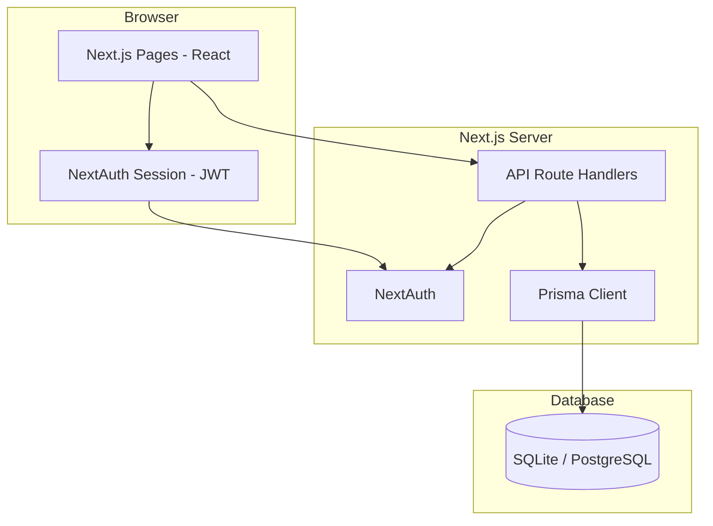
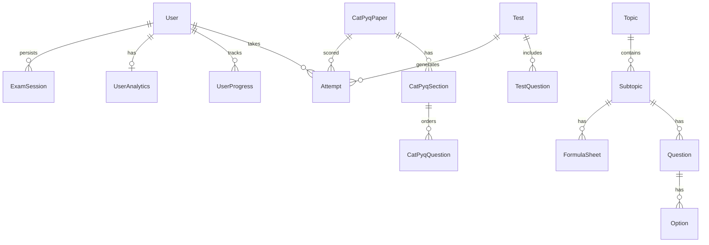

# Architecture

Technical overview of the CATPrep platform.

## High-Level Architecture



## Folder Structure

```
src/
├── app/                    # Next.js App Router
│   ├── api/                # REST API endpoints
│   │   ├── auth/           # NextAuth handler
│   │   ├── tests/          # Mock test CRUD & submit
│   │   ├── pyq/            # Previous year papers
│   │   ├── user/           # Profile, progress, analytics
│   │   ├── questions/      # Question fetching
│   │   └── admin/          # Admin upload & generate
│   ├── dashboard/          # Main user hub
│   ├── quant/              # Quant section routes
│   ├── varc/               # VARC section routes
│   ├── lrdi/               # LRDI section routes
│   ├── mock-tests/         # Full mock simulator
│   ├── pyq/                # PYQ listing & exam
│   ├── performance/        # Analytics dashboard
│   ├── profile/            # User profile
│   ├── admin/              # Admin panel
│   └── login/              # Authentication page
├── components/             # Shared React components
│   ├── pyq/                # PYQ exam-specific UI
│   ├── Sidebar.tsx         # Navigation sidebar
│   ├── TestSimulator.tsx # Mock test engine
│   └── PracticeSession.tsx # Practice mode UI
├── lib/
│   ├── auth.ts             # NextAuth configuration
│   ├── prisma.ts           # Prisma singleton
│   └── pyq/                # PYQ scoring, constants, auth helpers
├── config/                 # Static configuration
└── types/                  # TypeScript augmentations

prisma/
├── schema.prisma           # Database schema
├── seed.ts                 # Main seed script
└── seed-pyq.ts             # PYQ paper seed

public/                     # Static assets (images, logos)
data/                       # JSON schemas for imports
```

## Routing

CATPrep uses the **Next.js App Router** (`src/app/`).

| Route Pattern | Purpose |
|---------------|---------|
| `/` | Landing page |
| `/login` | Credential login |
| `/dashboard` | User home with goals & streaks |
| `/quant`, `/varc`, `/lrdi` | Section topic lists |
| `/{section}/[subtopicId]/formula` | Formula sheet |
| `/{section}/[subtopicId]/practice` | Practice questions |
| `/{section}/[subtopicId]/test` | Subtopic test |
| `/mock-tests` | Mock test catalog |
| `/mock-tests/[testId]` | Timed mock exam |
| `/mock-tests/result/[attemptId]` | Mock results |
| `/pyq` | PYQ paper list |
| `/pyq/[paperId]/exam` | Full PYQ simulation |
| `/pyq/[paperId]/analysis/[attemptId]` | PYQ analysis |
| `/performance` | Analytics charts |
| `/profile` | User settings |
| `/admin` | Content management |

### Layout Behavior

`LayoutWrapper` conditionally renders the sidebar:

- **Clean layout** (no sidebar): `/`, `/login`, active mock test, active PYQ exam
- **App layout** (sidebar + navbar): all other authenticated pages

## State Management

CATPrep does **not** use a global state library (Redux, Zustand). State is managed via:

| Layer | Approach |
|-------|----------|
| **Authentication** | NextAuth `SessionProvider` + `useSession()` |
| **Server data** | Fetch from API routes in `useEffect` / event handlers |
| **Exam state** | Local React state + server persistence (`ExamSession` model for PYQ) |
| **Theme** | `localStorage` + CSS `dark` class on `<html>` |
| **Daily goals** | Custom DOM event `daily-goals-updated` for cross-component refresh |

API routes use **Prisma** for all persistence. No client-side database access.

## Database Design

### Core Entities



### Key Models

| Model | Role |
|-------|------|
| `User` | Accounts with role (USER/ADMIN), streak, last active |
| `Topic` / `Subtopic` | Hierarchical content organization by section |
| `Question` / `Option` | MCQ and TITA questions with solutions |
| `Test` / `TestQuestion` | Mock and section tests |
| `Attempt` / `AttemptAnswer` | Scored test submissions |
| `CatPyqPaper` / `CatPyqSection` / `CatPyqQuestion` | Previous year paper structure |
| `ExamSession` | In-progress PYQ state (timers, answers JSON) |
| `UserProgress` | Per-subtopic checklist completion |
| `UserAnalytics` | Aggregated performance metrics |
| `DailyGoalProgress` | Daily question targets by section |

### Scoring

- **Mock tests**: Server-side scoring in `/api/tests/[testId]/submit`
- **PYQ**: Section-wise CAT scoring (+3/−1/0) in `src/lib/pyq/scoring.ts`

## Authentication Flow

1. User submits email/password on `/login`
2. NextAuth `CredentialsProvider` validates against `User` table (bcrypt)
3. JWT session stores `id` and `role`
4. Protected pages redirect unauthenticated users to `/login`
5. API routes call `getServerSession(authOptions)` or `resolveUserId()` helper

## API Design

REST-style route handlers under `src/app/api/`:

- `GET /api/topics` — Topic tree with progress
- `GET /api/questions?subtopicId=` — Practice questions
- `POST /api/tests/[testId]/submit` — Submit mock attempt
- `GET/POST /api/pyq/session` — PYQ exam persistence
- `GET /api/user/analytics` — Performance data

All routes return JSON. Errors use appropriate HTTP status codes.

## External Dependencies

| Package | Usage |
|---------|-------|
| `next` / `react` | Framework & UI |
| `next-auth` | Authentication |
| `prisma` / `@prisma/client` | ORM |
| `bcryptjs` | Password hashing |
| `katex` | Math rendering |
| `lucide-react` | Icons |
| `tailwindcss` | Styling |

## Future Architecture Considerations

- Extract exam engine into a shared hook/module
- Add Redis for session/rate limiting at scale
- Introduce proper migration files instead of `db push`
- Role-based middleware for admin API routes
- OAuth providers (Google) for easier onboarding
